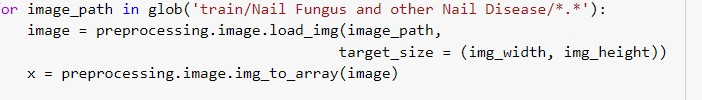
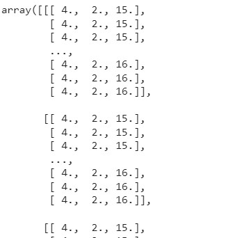
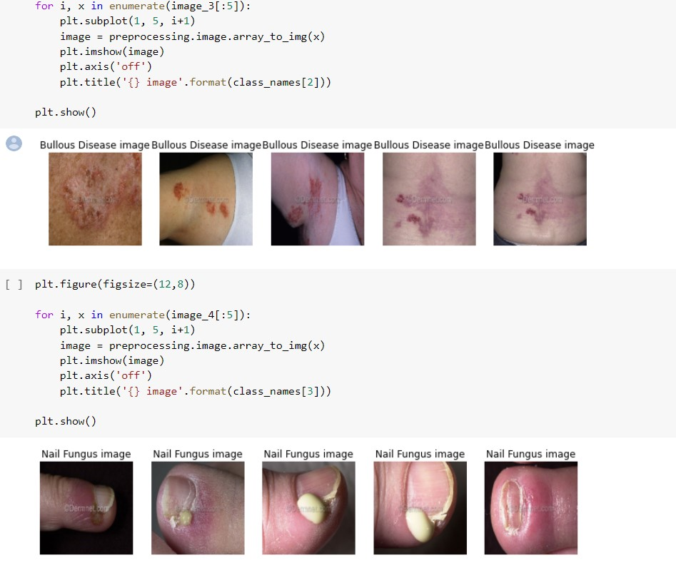
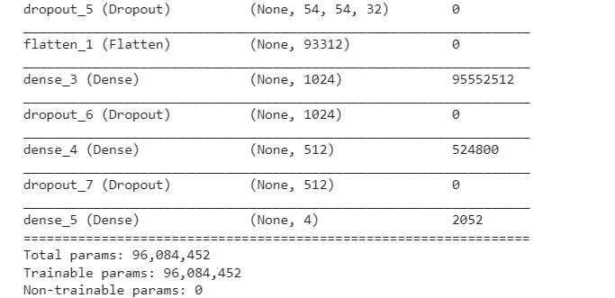
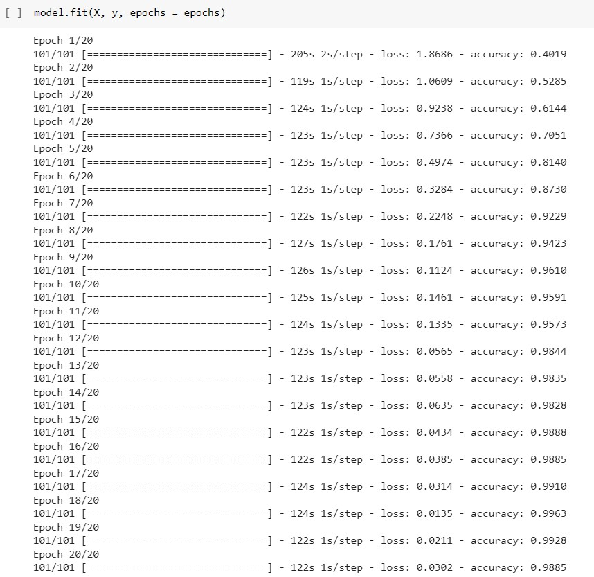
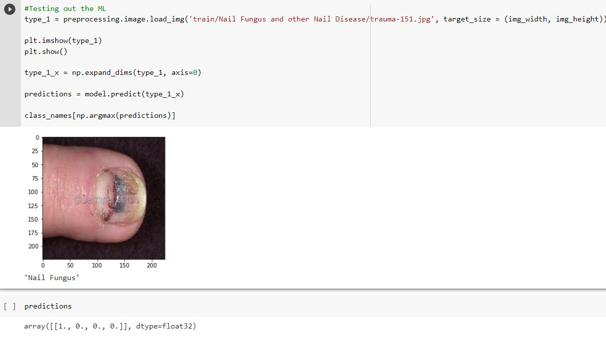

# **Skin Diseases classifier**

## **A mark of distinction or commonality-Skin disease imagery prediction**

 
<h3>Info</h3>
Our skin has been deemed the largest organ of the human body.  Skin disease varies from mild conditions that may affect only appearance to severe incapacitation.

 

<h3>Demo app </h3>

 

   The application will utilize predictive analysis to identify an associated skin disease to aid in treatment.

<h3>Data Source</h3>

  
https://www.kaggle.com/shubhamgoel27/dermnet

<h3> websites</h3>

  
- kaggle.com
  
- Dermnet.com

<h3> Info </h3>

The dataset  has 23 categories of skin diseases with a total of 19500 pictures and 15500 pictures of trained data .

  

<h3>Steps </h3>
<ul>
<li>Load & convert images into arrays </li>

<li>scale image array from 0 to 1</li>
<li>build model</li>

</ul>
Model accuracy : 

##### Local Predict Test:

